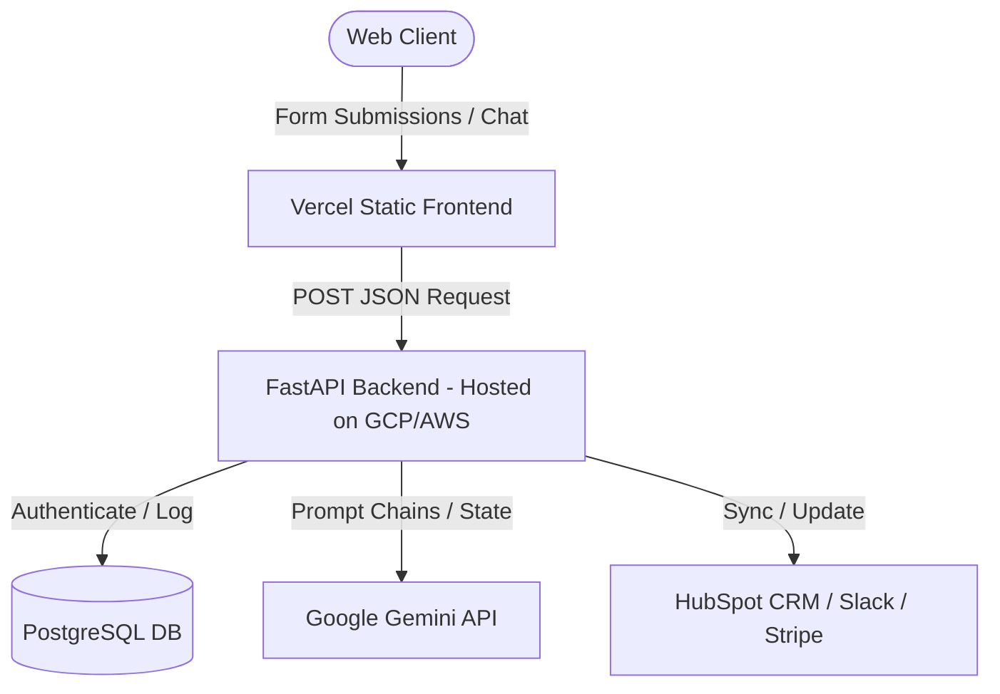

# System Architecture Blueprint

This document details the system architecture, file organization, backend integrations, and deployment configurations for the Liam AI Solutions codebase.

---

## 1. Directory Structure

The repository is organized as a lightweight, static-first web project, designed for easy expansion into a full-stack Python or Node.js application:

```
├── .git/                     # Version control metadata
├── .gitignore                 # Excluded directories (OS, editor temp files)
├── AI Agent Brief.pdf         # Core business requirements brief
├── Gemini.md                  # Google Gemini API integration guide
├── System.md                  # System architecture specifications (This file)
├── agent.md                   # AI Agent logic and state specifications
├── index.html                 # Main frontend landing page structure
├── style.css                  # UI styling system (Glassmorphic theme)
└── script.js                  # Frontend interactive scripts & simulators
```

---

## 2. Technical Stack Specifications

*   **Frontend Hosting**: [Vercel](https://vercel.com) (connected via GitHub CI/CD).
*   **Asset Performance**: Inline vector SVGs (ensuring instant renders and Zero-latency HTTP requests).
*   **Typography**: Google Web Fonts (Outfit for headings, Inter for body copy).
*   **Styling**: Modern CSS Grid and Flexbox layouts using CSS custom property design tokens.

---

## 3. Planned Full-Stack Backend Integration

To make the static landing page interactive (e.g., handling live email lead collection or running real-time AI agents), the system is architected to interface with a serverless backend.



### Proposed Backend Directory Layout:
```
backend/
├── app/
│   ├── main.py                # FastAPI entrypoint
│   ├── config.py              # Configuration & Environment loading
│   ├── api/
│   │   ├── endpoints/
│   │   │   ├── consultation.py # Receives landing page lead forms
│   │   │   └── chat.py         # Handles live AI Agent dialogue
│   ├── core/
│   │   ├── agents/            # LangGraph agent definitions
│   │   └── tools/             # Custom tools (Google Calendar, MLS DB)
│   └── database/
│       ├── models.py          # PostgreSQL models
│       └── session.py         # SQLAlchemy session configurations
├── requirements.txt           # Python dependencies
└── Dockerfile                 # Container configurations
```

---

## 4. Primary API Specifications

### 1. Lead Consultation Intake (`/api/consultation`)
Receives the form fields from the landing page footer component.
*   **Method**: `POST`
*   **Content-Type**: `application/json`
*   **Request Body**:
    ```json
    {
      "name": "John Doe",
      "email": "john@company.com",
      "website": "https://company.com",
      "bottleneck": "admin"
    }
    ```
*   **Response**:
    ```json
    {
      "status": "success",
      "message": "Lead ingested. Operations review scheduled.",
      "lead_id": "lead_98a319028"
    }
    ```

### 2. Live Agent Demo Simulator (`/api/simulate`)
Processes mock executions of AI Agents for frontend display.
*   **Method**: `GET`
*   **Response**: Array of execution steps containing system audits, tool logs, and final agent responses.

---

## 5. Hosting & CI/CD Pipeline

The project utilizes automated Continuous Integration and Continuous Deployment:
1.  **Code Push**: Pushing to the `main` branch of `github.com/mukeshkumarkella-code/ai-agent-landing-page` triggers Vercel.
2.  **Static Validation**: Vercel scans the project directory for `index.html`.
3.  **Edge Routing**: The site is cached globally on Vercel's Edge Network, delivering sub-100ms load times across North America.
