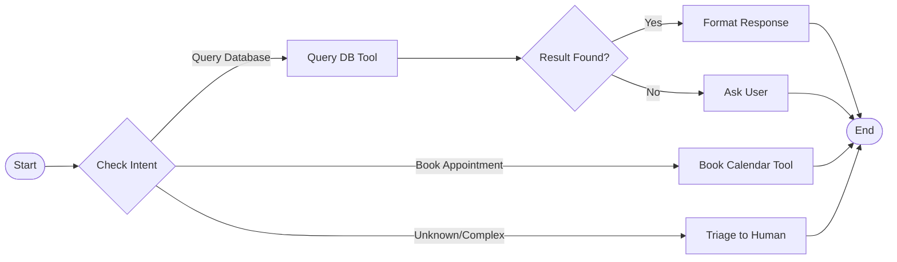

# AI Agent Architecture Specification

This document details the code-level design, orchestration frameworks, tools configuration, and state schemas for the AI Agents built by Liam AI Solutions.

---

## 1. Core Framework Selection

We utilize two primary patterns to orchestrate autonomous actions:

1.  **LangGraph**: Used for task-specific, rule-based workflows requiring deterministic state machines (e.g., booking viewings or qualifying construction bids).
2.  **CrewAI**: Used for multi-agent roles requiring collaborative, concurrent tasks (e.g., matching a candidate resume against multiple department skill sheets).

---

## 2. LangGraph State Machine Architecture

A standard Liam AI Agent is structured as a directed graph where nodes represent computational steps (LLM calls, tool executions) and edges represent conditional logic flow.



---

## 3. Python Implementation Outline (Real Estate Agent)

Below is an abstract design template for a real estate agent qualifying leads:

```python
from typing import TypedDict, List
from langgraph.graph import StateGraph, END

# Define Agent State
class AgentState(TypedDict):
    client_name: str
    client_budget: float
    current_intent: str
    available_slots: List[str]
    booking_status: str
    messages: List[dict]

# Define Nodes (Action functions)
def classify_intent(state: AgentState):
    # Gemini model parses request
    intent = "book_viewing" # Result from LLM
    return {"current_intent": intent}

def fetch_calendar(state: AgentState):
    # Call Cal.com or Google Calendar API
    slots = ["2026-06-10T14:00:00", "2026-06-10T16:00:00"]
    return {"available_slots": slots}

def complete_booking(state: AgentState):
    # Lock slot in Calendar and sync to HubSpot CRM
    return {"booking_status": "confirmed"}

# Compile Graph
workflow = StateGraph(AgentState)

# Add Nodes
workflow.add_node("classify", classify_intent)
workflow.add_node("get_slots", fetch_calendar)
workflow.add_node("book", complete_booking)

# Set Flow Edges
workflow.set_entry_point("classify")

# Conditional Router
def route_intent(state: AgentState):
    if state["current_intent"] == "book_viewing":
        return "get_slots"
    return END

workflow.add_conditional_edges(
    "classify",
    route_intent,
    {
        "get_slots": "get_slots",
        END: END
    }
)
workflow.add_edge("get_slots", "book")
workflow.add_edge("book", END)

# Compile active app
agent = workflow.compile()
```

---

## 4. Custom Tool Integrations

Agents interface with external systems using strict Python functions decorated as tools. Below is an integration schema:

```python
from langchain_core.tools import tool

@tool
def book_viewing_slot(client_email: str, slot_iso: str) -> str:
    """
    Connects to the Cal.com API and registers a booking slot.
    Returns confirmation ID.
    """
    # API code to Cal.com
    # payload = {"email": client_email, "time": slot_iso}
    # response = requests.post(CAL_URL, json=payload)
    return "Booking Confirmed: ID_982138a"

@tool
def update_crm_lead(email: str, budget: float) -> str:
    """
    Updates the contact budget preferences inside HubSpot CRM.
    """
    # API code to HubSpot SDK
    return "CRM Updated successfully"
```

---

## 5. Security & Isolation Parameters

To comply with the Liam AI Solutions Security Pledge (no public training, private data isolation):

*   **API Key Separation**: Ensure tool credentials (HubSpot API keys, Stripe tokens) are loaded from server environments, *never* exposed to the model context.
*   **Prompt Sanitization**: Strip PII (Personally Identifiable Information) like Social Security Numbers or raw credit card data before sending logs to API interfaces.
*   **Audit Logging**: Every tool execution must output structured trace logs (A-record logs) to an internal PostgreSQL database for human audit capability.
